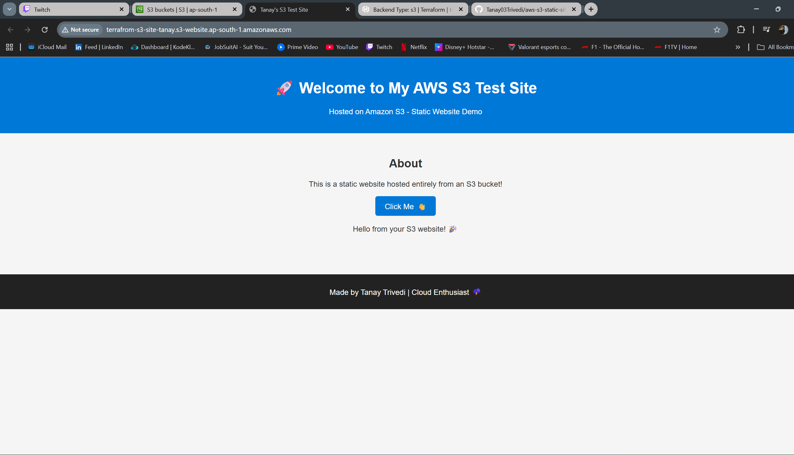

# 🚀 AWS S3 Static Website Deployment using Terraform

This project demonstrates how to **host a static website on AWS S3** using **Terraform** for complete infrastructure automation.

---

## 📸 Project Preview



---

## 🧠 Project Overview

This Terraform configuration:
- Creates an **S3 bucket** for static website hosting  
- Uploads static files (`index.html`, `style.css`, `script.js`)  
- Configures **public access & website hosting**  
- Manages **infrastructure as code (IaC)** with Terraform  
- Uses an **S3 remote backend** (`tf-remote-backend-tanay`) to store Terraform state securely  

---

## 🏗️ Architecture Diagram

```text
+----------------------+
|   Local Terraform    |
|  (.tf configuration) |
+----------+-----------+
           |
           | terraform apply
           v
+-------------------------+
|     AWS Infrastructure  |
|-------------------------|
|  S3 bucket (website)    | --> hosts index.html, CSS, JS
|  S3 bucket (backend)    | --> stores terraform.tfstate
+-------------------------+
